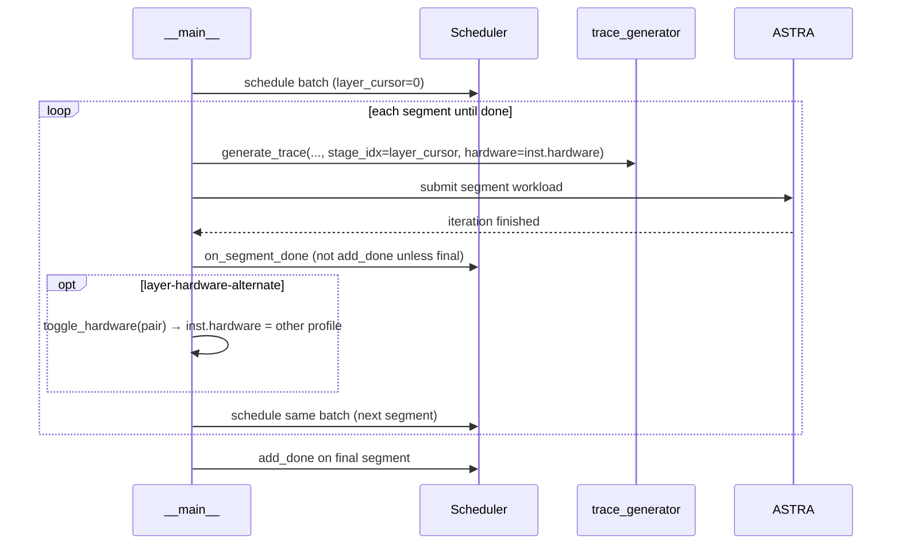

# feat/dvfs-scale: progressive device / profile swapping

Reference for layer-boundary control on branch **`feat/dvfs-scale`**.  
Related docs: [`CHANGES_forward_segments.md`](../CHANGES_forward_segments.md), [`WORK_LOG.md`](../WORK_LOG.md), [`outputs/branch_compare/RESULTS.md`](../outputs/branch_compare/RESULTS.md), [`forward_segments_debug.md`](forward_segments_debug.md).

---

## Core idea

**Before feat:** one forward pass = one ASTRA submission. Python only regains control after the full forward finishes, so DVFS/hardware changes happen only at **batch boundaries**.

**After feat:** with `--forward-segments per_block`, each forward is split into **N+2 ASTRA submissions** (prologue + one per transformer block + head). Python runs again after **every block**, so you can swap hardware/DVFS **between layers**.

For Llama-8B (`num_hidden_layers=32`): **34 stages** (prologue + 32 blocks + head).

---

## Three mechanisms (different granularity)

| Mechanism | CLI flags | What changes | When |
|-----------|-----------|--------------|------|
| **Batch-wise DVFS scale** | `--dvfs-switch-at T` + `--dvfs-scale S` | Latency multiplier on the **same** profiler profile | Sim time ≥ T, at iteration boundary |
| **Layer-wise hardware profile** | `--forward-segments per_block` + `--layer-hardware-alternate` | Whole-instance `hardware` string (e.g. `V100` ↔ `V100_1400MHz`) | After each segment (block) |
| **Work visibility** | `--work-events` / `--work-summary` | Nothing swaps — logs NPU work state | Per segment / periodic |

1. **Batch-wise scale** — coarse; all instances share one scale factor.  
2. **Layer-wise hardware** — the “progressive device swap” path.  
3. **Work events** — observability (from `dynamic-dvfs` work, merged on feat).

---

## How progressive swap works



### What “swapping devices” means in sim

The simulator does **not** hot-plug GPUs. It:

1. Changes `instances[i]["hardware"]` after segment `k`.
2. Next `generate_trace(..., stage_idx=k+1)` loads **`profiler/perf/<new_hardware>/...`** CSVs.
3. Power model uses **`power.npu[<new_hardware>]`** if power modeling is enabled.
4. `work_logger` emits `dvfs_switch` with `old_hardware` / `new_hardware`, `trigger: "layer"`.

---

## CLI reference

```bash
# Layer-boundary control (required for progressive swap)
--forward-segments per_block

# Toggle between two profiler hardware tags each block
--layer-hardware-alternate
--dvfs-hardware-alt V100_700MHz   # optional; else auto-pick from profiler/perf

# Batch-wise latency scale (orthogonal; same profile, multiply latency)
--dvfs-switch-at 0.5 --dvfs-scale 1.5

# Event log
--work-events outputs/events.jsonl
--work-summary outputs/work_summary.csv
```

### Example: layer-wise V100 DVFS alternation

```bash
python3 -m serving \
  --cluster-config configs/cluster/single_node_v100_qwen_moe.json \
  --dtype float16 --block-size 16 \
  --dataset workloads/example_trace.jsonl \
  --forward-segments per_block \
  --layer-hardware-alternate \
  --dvfs-hardware-alt V100_700MHz \
  --work-events outputs/v100_layer_alt_events.jsonl \
  --output outputs/v100_layer_alt.csv \
  --num-reqs 1
```

---

## Committed files (feat branch)

Commits on `feat/dvfs-scale` not in `main` (as of merge `b63b192`):

| Commit | Summary |
|--------|---------|
| `0a268e4` | Layer-wise work availability event logging + query tool |
| `0e9e0e5` | DVFS latency scaling at configurable simulated switch time |
| `91e19f0` | Per-block forward segments + layer hardware alternation |
| `bc99111` | Branch comparison + layer-hardware validation docs |
| `6ad0f42` | Minimal tensor sizes on segment bookend stubs (parity fix) |
| `87d775e` | Log bookend parity results |
| `9bcb726` | Heterogeneity model, power accounting, V100 profiling plan |

| File | Role |
|------|------|
| `serving/core/forward_segments.py` | Segment registry, workload slug `instance{id}_t{len}p{prefill}_s{stage}` |
| `serving/core/request.py` | `Batch.layer_cursor`, `num_stages`, `awaiting_segment_submit` |
| `serving/core/scheduler.py` | `_enable_segments`, `on_segment_done`, `_segment_continuation` |
| `serving/core/trace_generator.py` | `_synthesize_trace_stage`, `stage_idx`, bookend stubs, `dvfs_scale` on latencies |
| `serving/core/graph_generator.py` | Per-stage Chakra graphs |
| `serving/core/hardware_aliases.py` | `resolve_hardware_pair`, `toggle_hardware` |
| `serving/core/work_state.py` | `log_segment_complete`, `log_dvfs_switch` |
| `serving/tools/query_work_state.py` | Query work JSONL at time T |
| `serving/__main__.py` | CLI, registry, swap after non-final segments |
| `serving/tests/test_forward_segments.py` | Unit tests |

### Tests

```bash
cd LLMServingSim
PYTHONPATH=. python3 -m unittest serving.tests.test_forward_segments -v
PYTHONPATH=. python3 -m unittest serving.tests.test_hardware_aliases -v
```

---

## Constraints (by design)

- **`tp_size=1` only** for segmented path; DP groups rejected.
- Swap is **whole-instance** — one `hardware` string per instance, not per-GPU inside TP.
- Needs **profiler bundles for both** hardware tags (and `power.npu` entries if power modeling).
- **Not** heterogeneous PP inside one instance (e.g. 2 V100 stages + 2 H100 stages).
- Repo heterogeneity is **per-instance** in cluster config (replicas, P/D, multi-node). Router load-balances across instances.

---

## Validation (Jun 2026)

From [`outputs/branch_compare/RESULTS.md`](../outputs/branch_compare/RESULTS.md), 1-req Llama-8B bf16:

| Scenario | Sim clocks (ns) | vs mono | Notes |
|----------|-----------------|---------|-------|
| `main` / `feat` mono | 827,547,677 | — | Byte-identical CSV |
| `feat` seg (`per_block`) | 827,556,917 | +0.001% | After minimal bookend fix |
| seg + `--layer-hardware-alternate` (same device) | 827,556,917 | +0.001% | 0 switches; gated off |
| seg + RTXPRO6000 ↔ A6000 (seeded 1.25×) | ~925M | +11.8% | 2,310 hardware switches |

---

## V100 Qwen integration (local, may be uncommitted)

Wiring for bundled `profiler/perf/V100_*MHz/Qwen/...` profiles on top of feat.

### Configs added

| File | Purpose |
|------|---------|
| `configs/cluster/single_node_v100_qwen_moe.json` | Qwen MoE, `hardware: V100`, tp1 (layer-wise DVFS) |
| `configs/cluster/single_node_v100_qwen_moe_tp2.json` | Same model, tp2/ep2 (monolithic) |
| `configs/cluster/single_node_v100_qwen_moe_power.json` | Power-enabled template (NPU block filled per run) |

### Script added

| File | Purpose |
|------|---------|
| `scripts/run_v100_qwen_mhz_matrix.py` | Monolithic sim per `V100_*MHz` tag (no switching); writes `outputs/v100_qwen_mhz_matrix/summary.csv` |

```bash
docker exec servingsim_docker bash -c \
  'cd /app/LLMServingSim && python3 scripts/run_v100_qwen_mhz_matrix.py --num-reqs 1'
```

### `hardware_aliases.py` extension (local)

When `--layer-hardware-alternate` auto-picks a pair among V100 tags, prefer **farthest clock** (e.g. `V100` ↔ `V100_1400MHz`) instead of alphabetical `V100_1100MHz`.

### MHz matrix results (1 req, analytical power scaled by MHz)

| Hardware | Sim time (s) | Energy (kJ) |
|----------|--------------|-------------|
| V100_1400MHz | 22.87 | 12.44 |
| V100_1300MHz | 23.08 | 12.10 |
| V100 (baseline) | 23.34 | 12.01 |
| V100_1100MHz | 23.82 | 11.56 |
| V100_900MHz | 25.04 | 11.17 |
| V100_700MHz | 39.23 | 15.97 |

Artifacts: `outputs/v100_qwen_mhz_matrix/`. Energy uses **MHz-scaled analytical power** in the matrix script, not measured `nvidia-smi` watts.

**Profiler vs sim power:** profiler bundles are **timing only**. For calibrated energy per freq, run `profiler/power/profile_gpu_power.sh` at each locked clock and plug watts into cluster `power.npu` manually.

---

## Not implemented yet

1. **`--dvfs-schedule` JSON** — swap on specific layers, not blind alternation every block.
2. **Measured GPU power per freq** auto-ingested into cluster config.
3. **`tp>1` / DP** with per-segment barriers.
4. **Per-PP-stage hardware** — mixed V100+H100 in one instance.

---

## Related branches

| Branch | Notes |
|--------|-------|
| `feat/dvfs-scale` | Forward segments + layer hardware + batch dvfs_scale + work events |
| `test-EP-gen` | Separate EP generation test artifacts (`3d5182b`); not merged into feat |
| `dynamic-dvfs` | Work-state logging origin; merged into feat |
