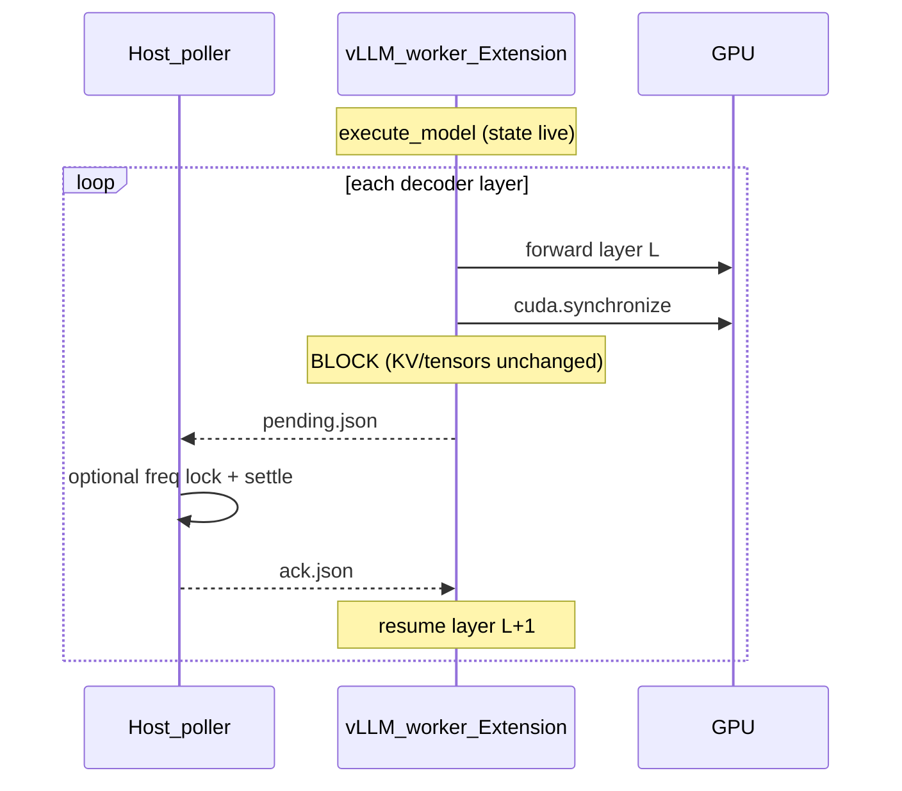

# In-place layer-boundary DVFS pause (profiler)

Work log for pausing vLLM **inside a live forward** at decoder layer boundaries so the host can change GPU frequency (or, for validation, simply ack and continue) without tearing down engine state. Intended to align real-hardware measurements with LLMServingSim, which does not yet model DVFS transition transients.

**Branch:** `feat/layer-boundary-dvfs-pause` (LLMServingSim repo)  
**Base commits:** `63bf2ae` … `b8966d7`

---

## Goal

At each transformer layer boundary during `model_runner.execute_model`:

1. Finish layer *L* and `cuda.synchronize()`.
2. **Block** — same worker process, same batch/KV/engine state.
3. Host changes GPU clocks (or, in smoke mode, only records the pause).
4. Worker unblocks and continues layer *L+1* in the **same** forward.

This is **not** stop-client / drain-queue / restart-serve / per-frequency Slurm jobs.

---

## Architecture



### Worker (`profiler/core/hooks/`)

| File | Role |
|------|------|
| `layer_barrier.py` | `InPlaceLayerBarrier` — post-forward hooks on `model.layers`; file-based `pending.json` / `ack.json` spin-wait |
| `extension.py` | `fire(..., barrier_dir=None)` — installs barrier during timed `layerwise_profile` loop only (not warmup) |

### Host (`profiler/core/dvfs_barrier.py` + shell poller)

| File | Role |
|------|------|
| `dvfs_barrier.py` | Python poller (in-container / no-sudo path), marker JSONL, `gpu_freq_lock.py` wrapper |
| `jobs/dvfs_barrier_host_poller.sh` | **Recommended on ARC** — runs outside Apptainer; has `sudo` for `nvidia-smi-clocks` |

Profiler runner (`profiler/core/runner.py`) gates barriers on `DVFS_LAYER_PAUSE=1`, passes `barrier_dir` into `collective_rpc("fire", ...)`, and limits shot count via `PROFILER_MAX_SHOTS`.

---

## Environment variables

| Variable | Purpose |
|----------|---------|
| `DVFS_LAYER_PAUSE=1` | Enable layer barriers in `fire()` |
| `DVFS_HOST_POLLER=1` | Skip in-container Python poller; use host shell poller |
| `DVFS_PAUSE_ONLY=1` | Ack barriers only — **no** `gpu_freq_lock` (smoke / A/B) |
| `PAUSE_ONLY_DELAY_SEC=0.05` | Artificial pause length in pause-only mode |
| `DVFS_FREQ_SCHEDULE=700,900,1100,1300` | MHz cycle at each layer boundary (real DVFS) |
| `GPU_FREQ_SETTLE_SEC=0` | Optional extra sleep after stable verification (default 0) |
| `DVFS_DECODE_MAX_PAUSES_PER_PASS=1` | Decode forwards: cap pauses per forward (prefill unrestricted) |
| `DVFS_DECODE_TOKEN_THRESHOLD=4` | Forwards with ≤N tokens treated as decode |
| `DVFS_PREFILL_MIN_TOKENS=8` | Forwards with ≥N tokens always treated as prefill |
| `PROFILER_MAX_SHOTS=1` | Cap shots per category (smoke / A/B) |
| `ENGS2950_ROOT=/data/engs-glass/engs2950` | Path to `shared/scripts/gpu_freq_lock.py` |

---

## Jobs and scripts

| Script | Description |
|--------|-------------|
| `jobs/run_arc_v100_layer_pause_smoke.sh` | Pause-only smoke (1 shot, markers check) |
| `jobs/submit_arc_v100_layer_pause_smoke.sh` | Slurm submit (interactive V100) |
| `jobs/run_arc_v100_layer_dvfs_smoke.sh` | Pause + real DVFS freq changes |
| `jobs/submit_arc_v100_layer_dvfs_smoke.sh` | Slurm submit for DVFS smoke |
| `jobs/run_arc_v100_layer_pause_ab.sh` | A/B: nopause vs pause-only, writes `ab_compare.json` |
| `jobs/submit_arc_v100_layer_pause_ab.sh` | Slurm submit (devel V100, 10 min) |

---

## Validation runs (ARC V100)

### Pause-only smoke — **PASS**

| Job | Node | Result |
|-----|------|--------|
| `7987472` | `htc-g046` (devel) | `PASS: pause/continue smoke` |
| `7987639` | (repeat) | `PASS` |

Evidence:

- Host poller: `PAUSE_ONLY layer=layers.0 idx=0`
- Marker in `dvfs_markers.jsonl` with `"mode": "pause_only"`, `"freq_mhz": null`
- Profiler completed (`dense.csv` written) after barrier ack

Example marker:

```json
{
  "event": "layer_boundary",
  "mode": "pause_only",
  "layer_name": "layers.0",
  "layer_idx": "0",
  "freq_mhz": null,
  "pause_start": 1781712235.852,
  "pause_end": 1781712235.905,
  "settle_sec": 0.05
}
```

Measured barrier duration ≈ **53 ms** (configured `PAUSE_ONLY_DELAY_SEC=0.05`).

### A/B comparison (nopause vs pause-only) — job `8007791` **COMPLETED**

Config: `meta-llama/Llama-3.1-8B`, dense slice, `PROFILER_MAX_SHOTS=1`, pause arm first then nopause.

Results (`profiler/perf/V100_layer_pause_ab_pause/.../tp1/ab_compare.json`):

| Metric | No pause | Pause-only | Notes |
|--------|----------|------------|-------|
| `marker_pause_sum_sec` | — | **0.054** | Ground-truth barrier time |
| `dense_category_sec` (progress) | ~0* | 6 | *2nd arm warm GPU |
| `slice_wall_sec` (full slice) | 41 | 119 | Dominated by engine boot |

**Per-layer `dense.csv` (`tokens=1`)**: unchanged within noise (e.g. `gate_up_proj` 605 µs vs 597 µs). Pause is **outside** `layerwise_profile` kernel timings.

**Takeaway:** intentional overhead at one layer boundary ≈ **50 ms** (measured **54 ms**). Full `profiler slice` wall time is not a good A/B metric because each arm reboots vLLM; the second arm benefits from a warm GPU.

---

## Outputs

| Path | Content |
|------|---------|
| `perf/<HARDWARE>/<model>/<variant>/tp1/dvfs_markers.jsonl` | One JSON line per layer boundary pause |
| `perf/.../tp1/dvfs_barriers/<shot_key>/pending.json` | Worker → host signal (transient) |
| `perf/.../tp1/dvfs_barriers/<shot_key>/ack.json` | Host → worker resume (transient) |
| `perf/.../tp1/ab_compare.json` | A/B timing summary |
| `profiler/jobs/logs/llmsim_layer_pause_*` | Slurm stdout/stderr |
| `profiler/jobs/logs/ab_<jobid>/nopause.log` | Per-arm profiler log (A/B) |

---

## Commit history (feature branch)

```
b8966d7 Fix A/B wall-time capture; pause arm before nopause
16ab3ca PROFILER_MAX_SHOTS on both arms; DVFS_PAUSE_ONLY on host poller
30faf82 Add A/B runner (ab_compare.json)
778ef15 Add pause-only smoke (DVFS_PAUSE_ONLY)
63bf2ae Add in-place layer-boundary DVFS pause for profiler fire()
```

---

## Limitations and next steps

1. **Bench path (v0.19)** — `python -m bench run` with `VLLM_LAYER_PAUSE=1` installs
   persistent hooks via `collective_rpc("layer_pause_install")` on the real model
   (full weights, all layers). Profiler `fire()` remains for synthetic shots.
2. **Host poller placement** — pause-only works with the in-process poller started
   from bench; real DVFS clock changes should use the host shell poller outside
   Apptainer (see `profiler/jobs/dvfs_barrier_host_poller.sh`).
3. **Apptainer jobs** must use **host shell poller** for sudo clock lock when DVFS
   is enabled (`VLLM_HOST_POLLER=1` / `DVFS_HOST_POLLER=1`).
4. **Concurrent requests** — barriers are per `execute_model` forward; TP>1 and
   heavy batching may need `max_num_seqs=1` for deterministic pause studies.
5. **Serve path** — same `worker_extension_cls` + host poller beside energy manifests.

---

## Quick commands

```bash
cd /data/engs-glass/engs2950/DVFS-MoE/LLMServingSim
export HF_TOKEN=...

# Pause-only smoke
./profiler/jobs/submit_arc_v100_layer_pause_smoke.sh

# A/B timing comparison
./profiler/jobs/submit_arc_v100_layer_pause_ab.sh

# On an allocated GPU node (no Slurm)
bash profiler/jobs/run_arc_v100_layer_pause_smoke.sh
```
